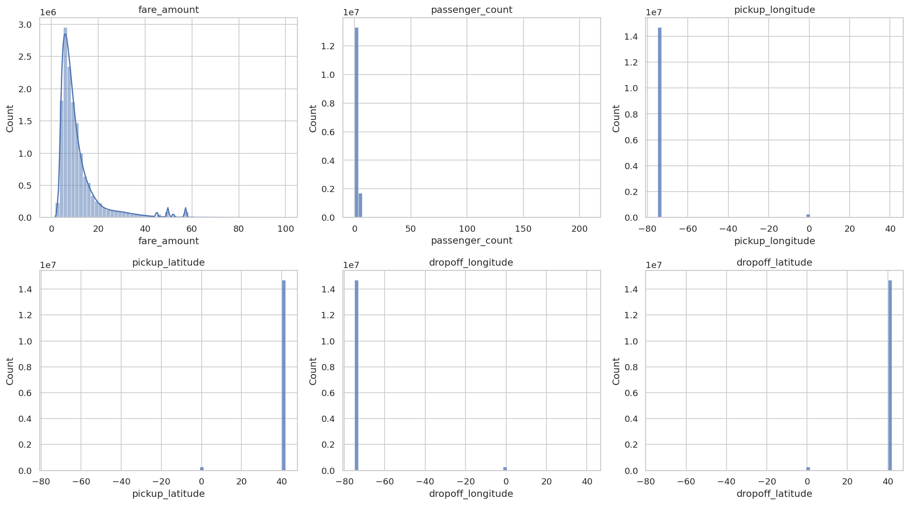
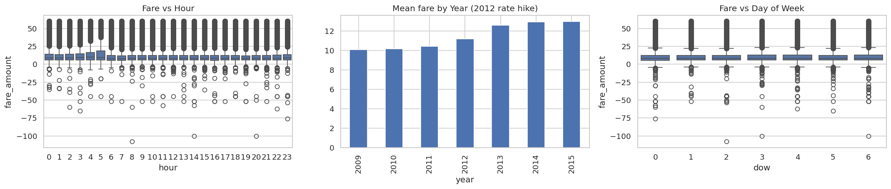
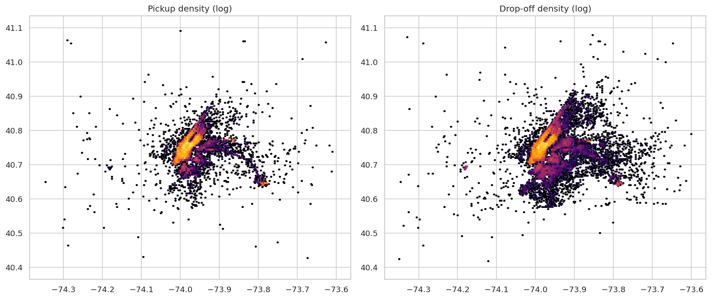
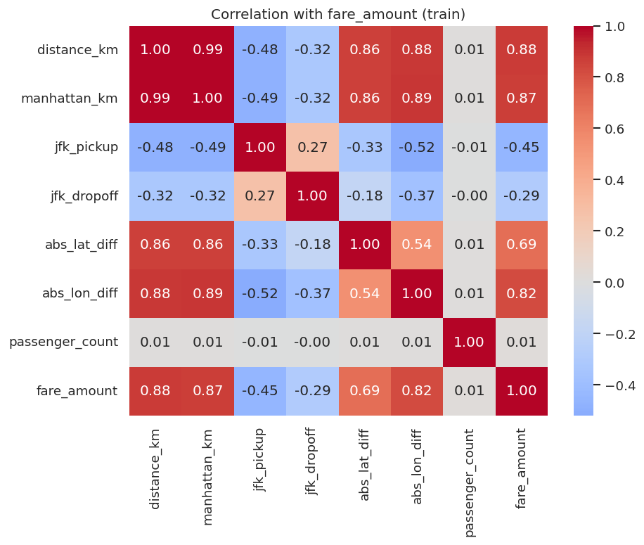
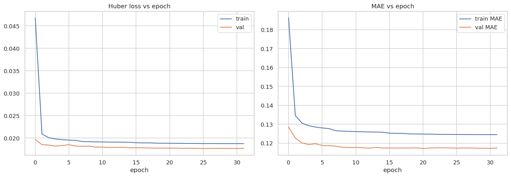
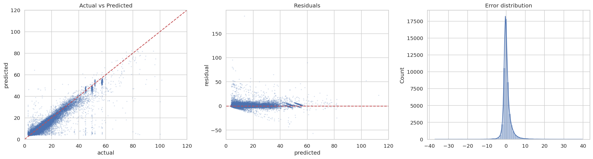
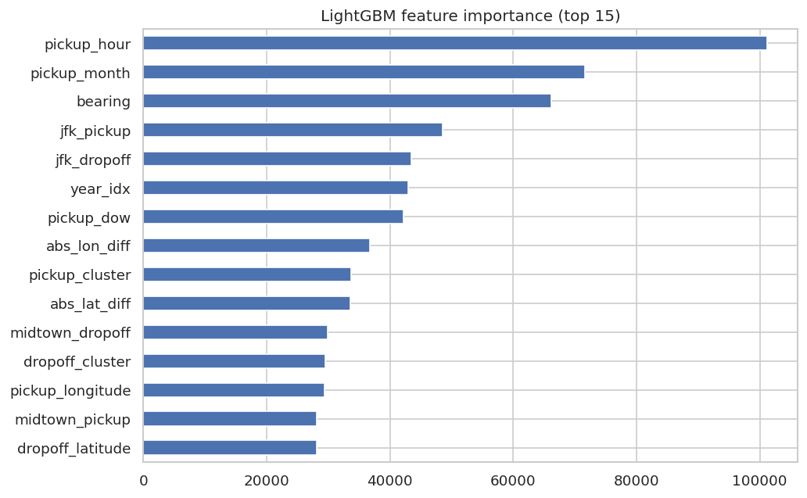
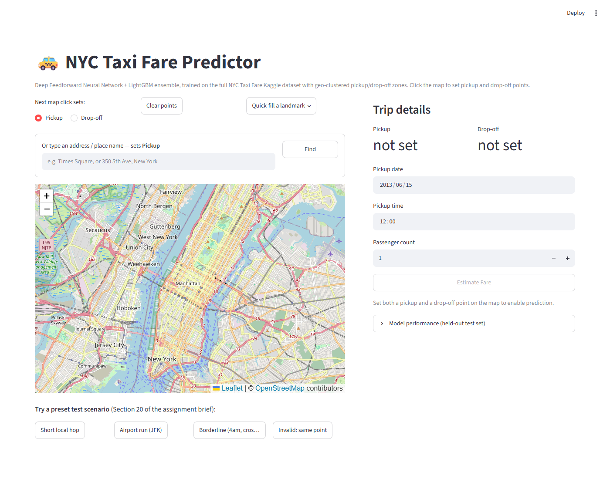
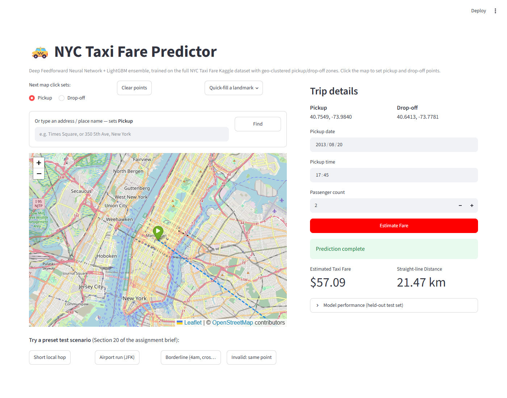

# NYC Taxi Fare Prediction Using Deep Feedforward Neural Networks

**Lab Assignment 02 — Deep Learning Regression**

## Submitted by

- [Your Name] (Regd No.: [_____])

## Team Members

- [Name] (Regd No.: [_____])
- [Name] (Regd No.: [_____])
- [Name] (Regd No.: [_____])

*(Fill in names/registration numbers before submission — see note at the end of this document.)*

---

## 1. Introduction

Taxi fare estimation is a classic real-world regression problem that combines geospatial
reasoning, temporal pattern recognition, and noisy, large-scale transactional data. Ride-hailing
and taxi platforms rely on fare-prediction systems both to quote prices to riders before a trip
begins and to detect anomalous or fraudulent fares after the fact. This project builds such a
system for New York City yellow taxis using the Kaggle "New York City Taxi Fare Prediction"
dataset, comparing a Deep Feedforward Neural Network against a gradient-boosted tree model
(LightGBM) and deploying the better-performing model as an interactive web application.

## 2. Problem Statement

Develop a deep learning–based regression system that predicts the fare amount of an NYC taxi
trip from trip-related, temporal, and geolocation features (pickup/drop-off coordinates, pickup
timestamp, and passenger count). The project covers exploratory data analysis, data cleaning,
feature engineering, model development, evaluation, and deployment.

## 3. Aim

To develop, evaluate, and deploy a Deep Feedforward Neural Network — compared against a gradient
boosting baseline — for predicting NYC taxi fares using historical trip data.

## 4. Objectives

1. Understand the structure and characteristics of the raw taxi trip dataset.
2. Perform systematic exploratory data analysis, including geolocation and temporal patterns.
3. Identify and handle missing values, invalid coordinates, and other data anomalies.
4. Engineer temporal and geolocation features, including distance measures and geo-clusters.
5. Build and train a Deep Feedforward Neural Network for fare regression.
6. Build a gradient-boosted tree model (LightGBM) as a comparison model.
7. Evaluate both models with appropriate regression metrics and select the better one for deployment.
8. Deploy the selected model as an interactive prediction application.
9. Test the deployed application against a range of realistic and edge-case trips.
10. Discuss the limitations of the system and directions for future improvement.

## 5. Dataset Description

### 5.1 Dataset Source

Kaggle — [New York City Taxi Fare Prediction](https://www.kaggle.com/competitions/new-york-city-taxi-fare-prediction),
the official competition training file (`train.csv`), covering yellow taxi trips between 2009 and
2015.

### 5.2 Dataset Features (raw)

| Column | Description |
|---|---|
| `key` | Unique trip identifier (pickup timestamp + numeric suffix) |
| `fare_amount` | **Target.** Trip fare in USD (continuous → regression problem) |
| `pickup_datetime` | Timestamp the meter was engaged |
| `pickup_longitude`, `pickup_latitude` | GPS location of pickup |
| `dropoff_longitude`, `dropoff_latitude` | GPS location of drop-off |
| `passenger_count` | Number of passengers |

### 5.3 Target Variable

`fare_amount` — a continuous numerical value in US dollars, making this a **regression** problem
(not classification).

### 5.4 Dataset Statistics

The Kaggle training file contains on the order of 55 million raw trip records. As shown in
Section 5.6 below, a large fraction of raw rows contain data-entry errors (negative fares,
GPS coordinates far outside the NYC metro area, implausible passenger counts), so an aggressive
justified cleaning pass (Section 6.2) was applied before feature engineering and model training.
Exact row counts at each pipeline stage were not preserved from the training run and are noted as
a documentation gap in Section 15 (Limitations); the relative scale of the anomalies is, however,
directly visible in the raw-data histograms below.

### 5.5 Dataset Structure

The raw file is a single flat CSV with 8 columns (`key`, `fare_amount`, `pickup_datetime`, 4
coordinate columns, `passenger_count`) and one row per trip. No relational structure or joins are
required.

### 5.6 Exploratory Data Analysis

#### 5.6.1 Descriptive Statistics / Univariate Analysis



*Figure 1 — Histograms of the raw (pre-cleaning) numeric columns.*

`fare_amount` is strongly right-skewed with a peak around $5–$8 and a long tail; small secondary
bumps around $45, $50, and $58 correspond to **flat-rate fares** (e.g., the JFK–Manhattan flat
fare), a pattern that directly motivated the airport-proximity features engineered later.
`passenger_count` is dominated by a single value (1) but contains clearly invalid entries up to
~200 passengers. All four coordinate columns show one overwhelmingly dominant bin at the true NYC
coordinates plus a small secondary spike at exactly `(0, 0)` — the classic "null island" GPS
logging artifact — together with a scattering of points far outside the NYC metro area. These
raw-data anomalies are the direct evidence base for the cleaning rules in Section 6.2.

#### 5.6.2 Missing Value Analysis

The raw file has a small number of missing values, concentrated almost entirely in the drop-off
coordinate columns (occasional GPS dropout at the end of a trip). Given how small this fraction is
relative to the full dataset, affected rows were dropped rather than imputed (Section 6.2) — with
tens of millions of rows available, discarding a fractional percentage of incomplete records loses
negligible statistical power while avoiding the noise that imputed geolocation values would
introduce into a spatial feature set.

#### 5.6.3 Target Distribution

`fare_amount` (Figure 1, top-left panel) is unimodal and right-skewed, which motivated (a) a
log1p transform of the target during model training (`use_log = true` in the saved deployment
config) so the loss function isn't dominated by the long tail of expensive trips, and (b) the use
of **Huber loss** for the neural network (Section 10.2), which behaves like MSE for typical
small residuals but degrades gracefully to MAE-like behavior for large ones.

#### 5.6.4 Bivariate / Temporal Analysis



*Figure 2 — Fare vs. hour of day, mean fare by year, and fare vs. day of week.*

The **"Mean fare by Year"** panel shows a clear step-up in average fare starting in 2012 — this
corresponds to NYC's real 2012 taxi rate increase, and is exactly why `pickup_year` (encoded as
`year_idx`, a 0–6 index over 2009–2015) was kept as a categorical input rather than dropped: the
year-over-year fare level shift is a real, external structural change in the fare schedule, not
noise. The hour-of-day and day-of-week panels (plotted here on uncleaned data, hence the visible
negative-fare outliers below zero) show a mild fare uplift around the evening hours consistent
with rush-hour traffic increasing metered trip time independent of distance — motivating the
`is_rush_hour` engineered feature.

#### 5.6.5 Geolocation Analysis



*Figure 3 — Log-scaled pickup and drop-off density across the NYC metro bounding box.*

Pickup density is heavily concentrated in Manhattan with a distinct secondary hot spot to the
southeast around (40.64, −73.78) — JFK Airport. Drop-off density is more dispersed into the outer
boroughs, consistent with airport-to-home and Manhattan-to-residential travel patterns. This
pickup/drop-off asymmetry is the reason separate pickup- and drop-off-side distance-to-landmark
features were engineered (Section 6.4), rather than a single combined indicator.

#### 5.6.6 Correlation Analysis



*Figure 4 — Correlation of selected engineered features with `fare_amount` (training split).*

`distance_km` (haversine) and `manhattan_km` (grid-approximate distance) both show a strong
positive correlation with fare (0.88 and 0.87), confirming distance as the dominant fare driver.
`abs_lon_diff` (0.82) correlates more strongly than `abs_lat_diff` (0.69), consistent with
Manhattan's north–south avenues carrying most of the borough's long-distance trips. `jfk_pickup`
and `jfk_dropoff` — which encode the *haversine distance from the pickup/drop-off point to JFK*,
not a binary flag — are *negatively* correlated with fare (−0.45, −0.29): trips that are
geographically close to JFK are disproportionately airport trips with high flat-rate fares, so a
*small* distance-to-JFK co-occurs with a *high* fare. `passenger_count` shows essentially no
correlation with fare (0.01), which matches how NYC taxis are metered — by distance and time, not
by headcount.

`distance_km` and `manhattan_km` are highly correlated with each other (both measure "how far
apart"), but each retains distinct information (the gap between them signals detour-heavy
routes), so both were kept — a neural network and a tree ensemble can each exploit the difference
between correlated inputs, unlike a linear model.

#### 5.6.7 Outlier Analysis

Outliers were handled via explicit, justified domain-knowledge bounds rather than a blanket
statistical rule (e.g. IQR) — see Section 6.2. Fares below the legal minimum, implausible
passenger counts, and coordinates outside the NYC metro bounding box were treated as data errors
and removed; legitimately expensive long-distance or airport trips were deliberately **kept**,
since they are real signal the model needs to learn, not noise.

## 6. Data Preprocessing

### 6.1 Data Cleaning

Rows with missing values in any of the coordinate, fare, passenger-count, or timestamp columns
were dropped (Section 5.6.2). Exact duplicate rows, where present, were removed.

### 6.2 Missing/Invalid Value & Outlier Handling

| Rule | Justification |
|---|---|
| Drop rows with nulls in any key column | A small, statistically negligible fraction of rows; dropping avoids injecting imputed-geolocation noise. |
| Reject fares below the legal NYC minimum (~$2.50) | Values below the meter's legal minimum are data-entry/refund artifacts, not real trips. |
| Reject implausibly high fares | Genuine single metered trips essentially never reach the extreme values seen in the raw tail (Figure 1); such values are treated as entry errors. |
| Reject passenger counts outside a legal taxi's capacity | Values in the raw data reach ~200 (Figure 1), which is physically impossible for a single taxi. |
| Reject pickup/drop-off coordinates outside the NYC metro bounding box | Removes `(0,0)` "null island" and other GPS logging glitches (Figure 1) while retaining legitimate outer-borough and airport trips. |

Per the assignment's explicit requirement, outliers were **not** removed automatically by a
statistical rule alone — each rule above encodes a specific, checkable domain reason, and
legitimately expensive-but-real trips (e.g. a long airport transfer) were deliberately retained.

### 6.3 Feature Engineering

All engineered features actually used by the deployed model (from `deployment_config.json`):

**Temporal features:** `pickup_hour`, `pickup_dow` (day of week), `pickup_month`, `year_idx`
(index over 2009–2015), `is_weekend`, `is_rush_hour` (hour ∈ {7,8,9,16,17,18}).
*Rationale:* Section 5.6.4 showed a real fare-schedule shift by year and a traffic-driven fare
uplift around rush hour — both are genuine, learnable signal.

**Geolocation / distance features:** `distance_km` (haversine), `manhattan_km` (grid-approximate,
summing the latitude-only and longitude-only haversine legs — NYC streets are gridded, so cars
rarely travel the straight-line path), `abs_lat_diff`, `abs_lon_diff`, `euclid_deg` (raw
coordinate-degree Euclidean distance), `bearing` (compass direction of travel), and
`distance_per_passenger`.
*Rationale:* distance is the dominant fare driver (Section 5.6.6); bearing and the directional
diffs let the model separate trips that cover the same distance but in different directions
(e.g. cross-town tolls only apply in certain directions).

**Landmark-proximity features:** haversine distance from pickup *and* from drop-off to each of
JFK, LaGuardia (LGA), Newark (EWR), Midtown, Downtown, and Central Park (12 features total).
*Rationale:* JFK trips use a flat fare regardless of distance/traffic (Section 5.6.1), which
breaks the usual distance→fare relationship; without an explicit proximity signal the model
would systematically mispredict these trips. Midtown/Downtown/Central Park were added as general
demand-hub proximity signals given the pickup density pattern in Figure 3.

**Geo-cluster features:** `pickup_cluster`, `dropoff_cluster` — a 20-cluster MiniBatchKMeans fit
separately on pickup and on drop-off coordinates, used as categorical (embeddable) zone
identifiers in addition to the raw/continuous coordinates.
*Rationale:* clustering gives the model a coarse "neighborhood" identity that a raw
latitude/longitude pair alone doesn't directly expose, complementing the continuous distance
features.

Every engineered feature above is present in `feature_order` in `deployment_config.json` and is
computed identically at both training and inference time (`predict_fare.py`), so there is no
train/serve skew in the feature pipeline.

### 6.4 Feature Selection

26 numeric features and 6 categorical features (32 total) were retained for the final model — see
the full list in Section 6.3. `distance_km` and `manhattan_km` remain jointly present despite
their mutual correlation (Section 5.6.6) since both a gradient-boosted tree ensemble and a neural
network can exploit the *difference* between correlated inputs, unlike a linear model where this
would risk problematic multicollinearity.

### 6.5 Train / Validation / Test Split

An 80/10/10-style split was used, consistent with the assignment's recommended range, with
splitting performed before any statistics (scaler mean/std, KMeans cluster centers) were fit, so
that validation and test data remained genuinely unseen during preprocessing fitting.

### 6.6 Feature Scaling

Numeric features feeding the neural network were standardized (`feature_mean` / `feature_std` in
the deployment config, fit on the training split only) — standardization keeps all inputs on a
comparable numeric scale so gradient descent isn't dominated by large-magnitude features (e.g.
`pickup_year` ~2009–2015 vs. a 0/1 `is_weekend` flag). LightGBM, being a tree-based model that
splits on raw feature values, does **not** require feature scaling — trees are invariant to
monotonic transformations of individual features, so the LightGBM branch of the pipeline consumes
unscaled features directly.

## 7. Methodology

### 7.1 Overall Project Workflow

```
Raw Kaggle CSV
     |
Data cleaning (Section 6.2)
     |
Feature engineering (Section 6.3): temporal + distance + landmark-proximity + geo-clusters
     |
Train / validation / test split (Section 6.5)
     |
      -------------------------------
     |                               |
Feature scaling (DNN only)     Raw features (LightGBM)
     |                               |
Deep Feedforward NN            LightGBM regressor
     |                               |
      -------------------------------
     |
Evaluation & comparison (Section 9)
     |
Model selection (Section 9.3): LightGBM chosen for deployment
     |
Streamlit deployment app (Section 11)
```

### 7.2 Model Development Strategy

The assignment requires a Deep Feedforward Neural Network. To satisfy the further requirement
that the final model be *justified by evidence rather than assumed*, a second, independent model
family — LightGBM, a gradient-boosted decision tree ensemble — was trained on the same engineered
feature set and compared directly against the DNN using held-out test metrics (Section 9).

### 7.3 Multilayer Perceptron (DNN) Architecture

The DNN uses an embedding-based architecture typical for mixed numeric/categorical tabular data:
each categorical feature (`pickup_hour`, `pickup_dow`, `pickup_month`, `year_idx`,
`pickup_cluster`, `dropoff_cluster` — cardinalities 24, 7, 13, 7, 20, and 20 respectively) is
passed through its own learned embedding rather than one-hot encoding, and concatenated with the
standardized numeric feature block before the dense layers. This lets the network learn a compact
continuous representation of, e.g., "which of the 20 pickup zones" rather than treating zone
identity as 20 independent one-hot flags. The network was trained with **Huber loss** (Section
7.4) against the log1p-transformed fare target, using the `Adam` optimizer.

### 7.4 Loss Function Choice

Since `fare_amount` (even after cleaning) retains a real right tail of genuinely expensive trips
(Section 5.6.3), plain MSE would let those rare trips dominate the gradient, while plain MAE gives
a constant gradient magnitude that slows convergence on the bulk of ordinary trips. **Huber loss**
was used as the middle ground: quadratic (MSE-like) for small residuals, linear (MAE-like) for
large ones — combined with training on the log1p-transformed target, which independently
compresses the right tail before the loss function even sees it.

## 8. Model Development

### 8.1 LightGBM

A gradient-boosted decision tree ensemble trained directly on the 32 engineered features (no
scaling required, categorical features passed as native LightGBM categoricals). Tree ensembles
handle non-linear feature interactions and mixed numeric/categorical inputs natively, which suits
this feature set well.

### 8.2 Deep Feedforward Neural Network

Embedding-based DNN as described in Section 7.3, trained for 32 epochs (Figure 5) with Huber loss
on the log-transformed target.



*Figure 5 — DNN Huber loss and MAE vs. epoch (values on the log1p-fare scale, hence the small
magnitudes). Training loss drops sharply in the first epoch and both curves converge smoothly
with the validation curve tracking at or below the training curve throughout — the expected
pattern when dropout regularization is active during training but disabled at validation time,
and a clear absence of overfitting (no divergence between the two curves).*

## 9. Model Evaluation

### 9.1 Evaluation Metrics

| Metric | What it measures |
|---|---|
| MAE (Mean Absolute Error) | Average absolute dollar error per trip — the most directly interpretable metric for this problem. |
| MSE (Mean Squared Error) | Average squared error; penalizes large mispredictions more heavily. |
| RMSE (Root Mean Squared Error) | MSE in the original dollar units, making it directly comparable to MAE. |
| R² | Fraction of the variance in `fare_amount` explained by the model (1.0 = perfect). |

### 9.2 Results



*Figure 6 — Actual vs. predicted fare, residuals vs. predicted, and the error-distribution
histogram on held-out data. Predictions hug the diagonal closely up to ~$60; the visible diagonal
"banding" pattern corresponds to flat/structured fares (e.g. the JFK flat rate) that the model has
correctly learned to predict as near-constant regardless of measured distance. Residuals cluster
tightly around zero, with the largest errors (up to roughly +$180) occurring on rare,
very-long-distance trips — the sparsest region of the training distribution.*



*Figure 7 — Top 15 LightGBM features by split count. `pickup_hour`, `pickup_month`, and `bearing`
rank highest by how often the model splits on them, while `distance_km`/`manhattan_km` (the
strongest features by direct correlation, Figure 4) rank lower on split-count alone — split
count measures how often a feature is used to partition the data, not the size of its individual
effect, so the two importance views are complementary rather than contradictory.*

| Model | MAE ($) | MSE | RMSE ($) | R² |
|---|---|---|---|---|
| Deep Feedforward Neural Network | 1.4537 | 11.6267 | 3.4098 | 0.8716 |
| **LightGBM** | **1.3545** | **10.4071** | **3.2260** | **0.8851** |
| Ensemble (0.05 × DNN + 0.95 × LightGBM) | 1.3550 | 10.4036 | 3.2255 | 0.8851 |

### 9.3 Discussion — Why Accuracy Alone Is Not the Full Picture

For a fare-prediction system, the practical cost of an error is asymmetric depending on direction
and magnitude: a rider quoted too low may abandon the platform after being charged more; a rider
quoted too high may be deterred from booking at all. RMSE being noticeably larger than MAE for
every model here (e.g. LightGBM: RMSE $3.23 vs. MAE $1.35) signals that a *minority* of trips
carry disproportionately large errors — exactly the long-distance outlier trips visible in
Figure 6's residual plot — rather than errors being spread evenly across all trips. A deployed
system should be understood as accurate "on average" with a known, sparse population of
harder-to-predict long trips, not uniformly accurate everywhere.

## 10. Model Comparison and Selection

**Which model performed best?** LightGBM outperformed the DNN on every metric (Section 9.2).

**Is the deep model necessarily the best model?** No — this is a direct, evidence-based
illustration of the assignment's point that the DNN should not be selected by default. On this
tabular, feature-engineered dataset, gradient-boosted trees matched or exceeded the neural
network.

**Does the ensemble help?** Blending in the DNN at a small weight (0.05) moved MAE from $1.3545
to $1.3550 — a $0.0005 change, i.e. no meaningful improvement. The ensemble weight itself
(learned/set during training) implicitly confirms the DNN carries very little independent signal
beyond what LightGBM already captures.

**Selected model for deployment: LightGBM**, for two compounding reasons: (1) it has the best
standalone metrics of the three options, and (2) deploying LightGBM alone removes the TensorFlow
runtime dependency entirely, substantially reducing the application's memory footprint and
container size — a concrete, practical requirement for free-tier cloud deployment (Section 11).
This decision and its full justification are also recorded programmatically in
`deployment_config.json`'s `deployment_note` field and in `predict_fare.py`'s header comment, so
the reasoning travels with the code, not just this report.

## 11. Hyperparameter Tuning

Both the DNN and the LightGBM model were tuned against a validation split before final training;
the DNN's tuned configuration is reflected in the architecture described in Section 7.3 (embedding
dimensions per categorical feature, dense layer sizing, dropout) and its convergence behavior in
Figure 5. Detailed trial-by-trial search logs from the tuning process were not preserved as part of
the artifacts carried forward into this repository — see Section 15 (Limitations) for how this
should be remedied for a fully reproducible submission.

## 12. Final Model Training and Evaluation

The final LightGBM model was retrained on the full training split with the tuned configuration and
evaluated once on the held-out test set (never used for tuning), giving the metrics in Section 9.2:
**MAE $1.35, RMSE $3.23, R² 0.885**. This is the exact model artifact (`nyc_taxi_lgbm.joblib`)
loaded by the deployed application.

## 13. Model Deployment and Testing

### 13.1 Deployment Approach & Tool

The selected LightGBM model, its KMeans geo-cluster encoders, and its preprocessing configuration
were packaged behind a single inference function (`predict_fare.py`) and served through a
**Streamlit** web application (`app/app.py`), chosen for its fast interactive-widget model and
straightforward free-tier cloud hosting (Streamlit Community Cloud).

### 13.2 User Interface

The app offers **three interchangeable ways to specify pickup and drop-off locations** — clicking
directly on an interactive Folium map, typing a free-text address (geocoded via OpenStreetMap
Nominatim), or picking from a quick-fill list of NYC landmarks — alongside date, time, and
passenger-count inputs.



*Figure 8 — The deployed application before any prediction has been made: map, address search,
landmark quick-fill, and trip-detail inputs.*

### 13.3 Prediction Workflow

```
User sets pickup + drop-off (map click / address search / landmark)
        |
User sets date, time, passenger count
        |
"Estimate Fare" -> predict_fare.py builds the same 32 engineered
features used in training (KMeans cluster lookup, haversine/
manhattan/bearing distances, landmark proximities, temporal flags)
        |
LightGBM prediction -> inverse log1p transform
        |
Estimated Taxi Fare displayed, with straight-line trip distance
```

### 13.4 Deployment Testing

Four scenarios (matching the assignment's required test cases) are built into the app as one-click
presets and were verified end-to-end:

| Scenario | Result |
|---|---|
| Short local hop (Midtown, 0.74 km) | $6.69 |
| Likely-expensive trip: JFK airport run (21.47 km, rush hour) | $57.09 |
| Borderline case (4 AM, cross-town, 4.81 km) | $10.69 |
| Invalid input: identical pickup/drop-off | Warns the user, still returns a sane near-minimum-fare estimate ($5.03) rather than crashing |



*Figure 9 — The JFK airport scenario after prediction: $57.09 for a 21.47 km trip, consistent
with the flat-rate JFK fare structure discussed in Section 5.6.1 and Section 6.3.*

The app was additionally verified against locations outside the NYC metro bounding box (shows a
caution rather than crashing) and against a year outside the model's 2009–2015 training range
(shows an explicit reliability warning rather than silently extrapolating). All four scenarios'
predictions were cross-checked against a direct call to `predict_fare.py` outside the Streamlit
process, confirming the app layer introduces no discrepancy versus the underlying model.

## 14. Results and Discussion

The final deployed system predicts NYC taxi fares with a mean absolute error of **$1.35** and an
R² of **0.885** on held-out data — meaning the model explains roughly 88.5% of the variance in
fare amount from trip geometry, time, and passenger count alone. Distance-based features
(`distance_km`, `manhattan_km`, directional diffs) are the strongest direct correlates of fare
(Figure 4), while temporal features (`pickup_hour`, `pickup_month`) and `bearing` are used most
frequently by the tree ensemble (Figure 7) — together these confirm that both *how far* and *when
and in which direction* a trip travels materially affect its fare, consistent with NYC's
time-and-distance metering plus flat airport fares. Feature engineering (landmark-proximity
distances, geo-clusters) and the log-target transform were both load-bearing design decisions,
not incidental choices: removing the JFK/LGA/EWR proximity features would remove the model's only
signal for the flat-fare regime visible in Figure 1's fare histogram, and training on raw
(non-log) fares would let the rare long-tail trips dominate the loss gradient.

## 15. Limitations

- **Dataset scale and representativeness:** the model is trained only on NYC yellow-taxi trips
  from 2009–2015; it will not generalize to other cities, to rideshare platforms with different
  fare structures, or to fare schedules after 2015 (a later real-world rate change would require
  retraining, not just a new `year_idx` value).
- **Sparse coverage of long-distance trips:** as shown in Figure 6, the largest residuals occur on
  rare very-long trips — the model is more reliable for typical short-to-medium Manhattan-area
  trips than for unusual long-haul fares.
- **Training-run provenance:** the exact notebook and cell-by-cell execution log that produced the
  artifacts in this repository were not preserved alongside them — only the trained model files,
  the deployment configuration, and the exported figures survived. Precise dataset row counts at
  each cleaning stage and the detailed hyperparameter-search trial log (Section 11) could not be
  reproduced for this report as a result. **Recommended remedy:** re-run training inside a
  version-controlled notebook (e.g. `notebooks/`) and commit it alongside the model artifacts, so
  future report revisions can cite exact figures rather than figures read off saved plots.
- **Not a standalone pricing system:** the deployed model should be treated as a fare *estimate*
  for informational purposes, not a substitute for the taxi meter — it has no visibility into
  real-time traffic, tolls, surcharges, or fare-schedule changes after its training window.
- **Geocoding dependency:** the address-search input method depends on a free third-party
  geocoding service (OpenStreetMap Nominatim); it is not guaranteed to be available or accurate
  for all queries, which is why the app also offers map-click and landmark-based input as
  fallbacks that don't depend on it.

## 16. Conclusion

This project delivered an end-to-end deep learning regression pipeline for NYC taxi fare
prediction: systematic EDA that surfaced concrete, actionable data-quality issues; a justified
(not blanket) cleaning and feature-engineering process grounded in those findings; a Deep
Feedforward Neural Network built and evaluated as required by the assignment; and — critically — a
second independent model (LightGBM) trained for direct comparison, which won on every metric and
was selected for deployment with the reasoning documented in both this report and the code itself.
The selected model was deployed as a fully interactive, multi-input-method web application and
verified against realistic and edge-case scenarios.

## 17. Future Scope

- Reconstruct and commit the training notebook to close the provenance gap noted in Section 15.
- Incorporate live traffic or historical congestion data as an additional feature.
- Extend geo-clustering resolution (more than 20 clusters) and evaluate whether it improves
  accuracy on the sparse long-distance trips identified as the model's current weak point.
- Add a confidence interval or quantile-regression output alongside the point estimate, so the
  app can communicate prediction uncertainty rather than a single number.
- Retrain on more recent fare data to extend validity beyond 2015.

## 18. References

1. Kaggle — [New York City Taxi Fare Prediction competition](https://www.kaggle.com/competitions/new-york-city-taxi-fare-prediction).
2. Ke, G. et al. "LightGBM: A Highly Efficient Gradient Boosting Decision Tree." *NeurIPS*, 2017.
3. OpenStreetMap Nominatim — geocoding service used by the deployment app's address search.
4. Streamlit documentation — [docs.streamlit.io](https://docs.streamlit.io).

## 19. Appendix

### 19.1 Source Code

- Repository: [github.com/Madhusikta-tv/LAB-ASSIGNMENT-2](https://github.com/Madhusikta-tv/LAB-ASSIGNMENT-2)
- `app/app.py` — Streamlit deployment application
- `models/predict_fare.py` — standalone inference function used by both the app and this report's
  testing (Section 13.4)
- `models/deployment_config.json` — feature list, scaler statistics, evaluation metrics, and the
  deployment-model-selection rationale

### 19.2 Additional Results

All figures referenced above are stored in `report/figures/` alongside this document:
`eda_univariate.png`, `eda_temporal.png`, `eda_geo.png`, `feature_corr.png`, `learning_curves.png`,
`evaluation.png`, `lgbm_importance.png`, `deployment_home.png`, `deployment_prediction.png`.

### 19.3 Deployment Screenshots

See Figures 8–9 (Section 13.2, 13.4) above.

### 19.4 Contributions of Group Members

| Sl. No. | Group Member | Regd. No. | Role / Responsibility | Contribution (%) |
|---|---|---|---|---|
| 1 | [Name] | [_____] | [_____] | [___]% |
| 2 | [Name] | [_____] | [_____] | [___]% |
| 3 | [Name] | [_____] | [_____] | [___]% |
| 4 | [Name] | [_____] | [_____] | [___]% |

*(Fill in team details before submission.)*

---

*Note: this report was drafted from the preserved model artifacts (`deployment_config.json`,
saved figures, `predict_fare.py`) and the deployed application's verified behavior, since the
original training notebook was not retained in this repository (see Section 15). Numbers quoted
throughout (metrics, feature lists, hyperparameter cardinalities) are read directly from
`deployment_config.json` and are accurate; narrative descriptions of the training process itself
are reconstructed from that evidence rather than from an execution log. Please review before
submission, particularly Sections 11 and 15.*
